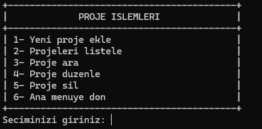
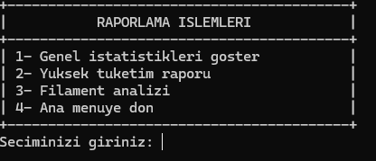

3D Baskı Atölye Yönetim Sistemi

Bu proje Python ile geliştirilmiş basit bir konsol uygulamasıdır.
3D baskı projelerini kaydetmek, düzenlemek ve takip etmek için kullanılır.

Özellikler
Proje ekleme
Projeleri listeleme
Proje arama
Proje düzenleme
Proje silme
İstatistik gösterme
Maliyet Hesaplama

Program maliyeti otomatik hesaplar.

PLA → 500 TL/kg
ABS → 560 TL/kg
PETG → 430 TL/kg
 

 
exe dosyasını çalıştırıca karşınıza burası gerlir ve burdan yapacağınız işlemi seçersiniz.
 

 
proje işlemlerine girnce alt başlıklı burası gelir ve burdaki herşey çalışır ve şeçip size sorduğu soruları cevaplayın ve kaydedin siz kaydetmiyosunuz proje kendisi kaydediyor:)
 

 
bu seçenekte raporlama islemleri bulunuyor burda analizlerinizi ve tüketimlerinizi gösterir genel ve en yüksek tüketimi değerlendirebilirsiniz.

PROJEME BAKTIĞINIZ İÇİN TEŞEKKÜRLER :)
